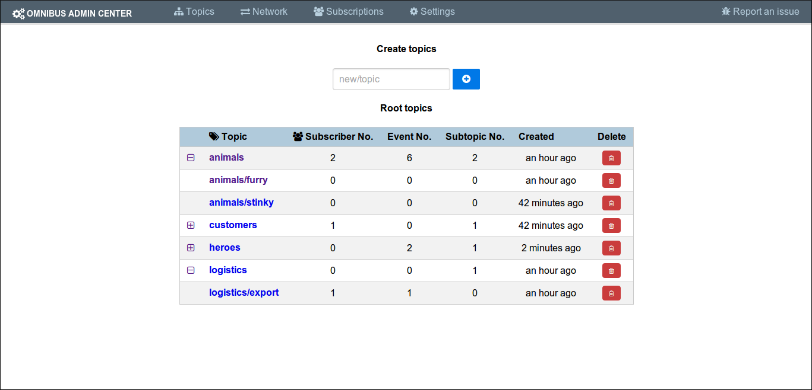
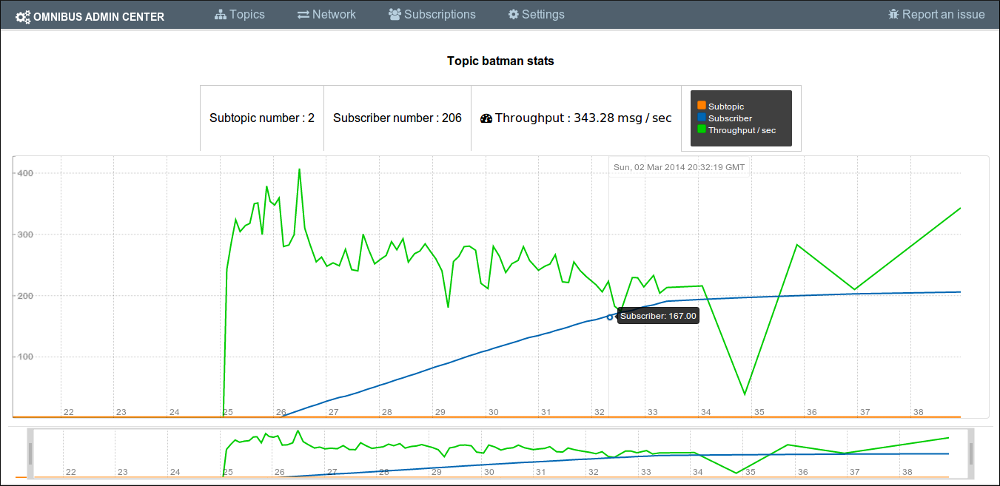

Omnibus  [](https://travis-ci.org/agourlay/omnibus)
=========

Omnibus is an HTTP-friendly reactive message bus which means :

 - Topic hierachies and subscriptions are managed via a rest API.
 - Updates are streamed by [Server-Sent-Event](http://www.html5rocks.com/en/tutorials/eventsource/basics/) which can be easily consumed by javascript frontends. 
 - With reactive modes it is possible to replay specific parts of the events.
 - Subscriptions can be composed via the url keyword `+`.
 - Most of the features can be accessed via the administration web interface.

**This is still a work in progress, any API is likely to change** 

## Getting started

Get the latest omnibus.tar distribution, extract and run the starting script in `/bin`.

This starts Omnibus on default port 8080.

You can configure the system by changing the properties in `/conf/application.conf`.

```
omnibus {
    http {
        port = 8080
    }
    admin {
        userName = "admin"
        password = "omnibus"
    }
    topic {
        retentionTime = "3 days"
    }
    statistics{
        storageInterval = "60 seconds"
        retentionTime = "3 days"
    }
}
```

The system is running, now let's explore the API.
 
## REST & hal+json

Omnibus follows the specification [hal+json](http://stateless.co/hal_specification.html) to expose its resources. 

It simply means that the REST API is easily discoverable.

Let's demonstrate how it works with some basic commands using CURL.

Topics are trees, you can create them simply with a POST request.

The root url of every topic is `/topics`.

> curl -X GET http://localhost:8080/topics

```json
[]
```

We receive the empty collection of roots.

Use POST to create the nested topic `/topics/animals/furry`.

> curl -X POST http://localhost:8080/topics/animals/furry

We can now retrieve informations about the topic we just created using GET

> curl -X GET http://localhost:8080/topics/animals

```json
{
  "topic": ["animals"],
  "subTopicsNumber": 1,
  "subscribersNumber": 0,
  "eventsNumber": 0,
  "creationDate" : 1390212312,
  "viewDate": 1390212364,
  "_embedded": {
    "children": [
      { "furry": { "href": "/topics/animals/furry" }}
    ]
  },
  "_links": [
    { "self": { "href": "/topics/animals" }},
    { "subscribe": { "href": "/streams/topics/animals" }},
    { "stats": { "href": "/stats/topics/animals" }}
  ]
}
``` 

You get there almost all the informations you need to interact with a topic in a REST fashion way.

With PUT you can push data to an existing topic.

> curl -X PUT http://localhost:8080/topics/animals -d "dolphins are the best"

If you publish a message at the `/animals` level, all subtopics will receive it as well.

It is possible to DELETE a topic and all its subtopics via the [administration](https://github.com/agourlay/omnibus#administration) API. 

You can also request the collection of leaves topic using `GET /leaves`. It is a streamed API, so you will receive topics as the topic trees are traversed. 

> curl -X GET http://localhost:8080/leaves

> ~~> Streaming topic view 

And finally you can of course subscribe to the notifications on a topic.

> curl -X GET http://localhost:8080/streams/topics/animals

> ~~> Streaming subscription for topics /animals

## Subscription models

Omnibus follows the common subscription model used in similar systems :

- when subscribing to a `parent` topic, one will see all updates occuring in the subtopics as well.
- when subscribing to a `leaf` topic, one will only see the updates targeting this topic directly.

## Reactive modes

Omnibus supports reactive modes via url parameters in order to replay specific sequence of events from topics.

The supported modes are: 

- `simple`   : classic subscription (default one if not specified)

- `last`     : get last message on a topic and the following events
  - e.g http://localhost:8080/streams/topics/stock/nasdaq?react=last

- `replay`   : get all past messages on topic and the following events
  - e.g http://localhost:8080/streams/topics/customer/order?react=replay

- `since-id` : all the past events since a given event-id and the following events
  - e.g http://localhost:8080/streams/topics/worldcup?react=since-id&since=120

- `since-ts` : all the past events since a given unix timestamp and the following events
  - e.g  http://localhost:8080/streams/topics/logs?react=since-ts&since=1388250283

- `between-id` : all the events between two given event-id 
  - e.g http://localhost:8080/streams/topics/worldcup?react=between-id&since=12&to=200

- `between-ts` : all the events between two given unix timestamp
  - e.g  http://localhost:8080/streams/topics/logs?react=between-ts&since=1388250283&to=1388250552

> curl -X GET "http://localhost:8080/streams/topics/results/basketball?react=between-id&since=1&to=2"

> ~~> Streaming subscription for topics /results/basketball with mode replay

> id: 1
> event: /result/basketball
> data: A basket ball game result
> timestamp: 1388250283

> id: 2
> event: /result/basketball
> data: Another basket ball game result
> timestamp: 1388250552

## Composable subscriptions

You can compose subscriptions with the char `+` in order to merge notifications from multiple topics.

> curl -X GET http://localhost:8080/streams/topics/customer/order/+/logistic/export

> ~~> Streaming subscription for topics /customer/order + /logistic/export with mode simple

All the topics must exist at the moment of the subscription or the whole request will be rejected.

Of course you are can use reactive modes on composed subscriptions but be ready to handle the flow of data if you target a root topic with the replay mode :D

## Administration

All administration features are protected by http basic authentication. (better than nothing for now)

By default the admin credentials are `admin/omnibus`, this can be changed in the configuration file.

The administration module exposes 3 API :

- `DELETE /admin/topics/{topic-name}` to delete a topic and its subtopics

- `GET /admin/subscribers` get all subscriptions

- `DELETE /admin/subscribers/{subscriber-id}` kill a subscription

You can also use the administration web interface running on http://localhost:8080/ to manually access most of the API and statistics.



And here some realtime stats about a topic



## Monitoring

If you just want to get raw data about usage, omnibus exposes statistics concerning all topics and the system itself following three modes.

- `live` : get the current statistics. (default mode)
  - e.g  http://localhost:8080/stats/topics/animals/furry/
  - e.g  http://localhost:8080/stats/system

- `history` : get all statistics history available. (you can configure retention time)
  - e.g  http://localhost:8080/stats/topics/animals/furry/?mode=history
  - e.g  http://localhost:8080/stats/system?mode=history

- `streaming` : continous data stream of statistics in realtime
  - e.g  http://localhost:8080/stats/topics/animals/furry?mode=streaming
  - e.g  http://localhost:8080/stats/system?mode=streaming

## Persistence

Omnibus persists events in order to be able to replay them later.

By default those events are persisted to a local LevelDB instance. The location of the LevelDB files is a directory named `/data` in the current working directory but it is possible to store events using an external database.

So far only [Cassandra](http://cassandra.apache.org/) is supported through the akka-persistence-plugin, see [here](https://github.com/krasserm/akka-persistence-cassandra#configuration) for complete configuration.

The retention time is configurable as well for both persistence solutions.

## Build and contribute

Build the project with sbt, I personnaly like `~re-start` to restart the application automatically when a file system change occurs.

If you want to build the frontend, you need [Bower](http://bower.io/) and [Grunt](http://gruntjs.com/) for javascript build management.

Then in the folder `src/main/resources/frontend` run 

>npm install

>bower install

>grunt

Then you are good to go!

[](https://bitdeli.com/free "Bitdeli Badge")